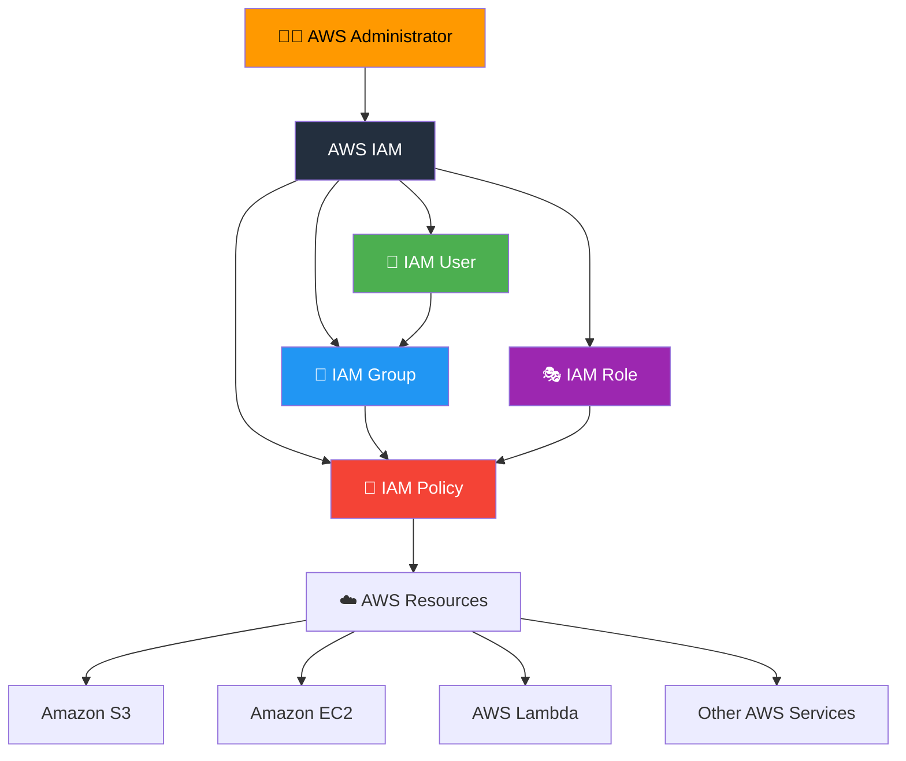
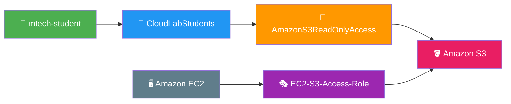
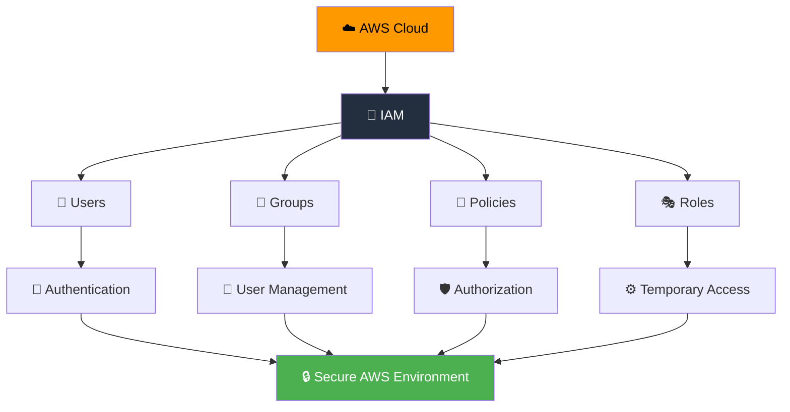

Absolutely. Below is a **modern, GitHub-ready `README.md`** for **Practical 1 – AWS IAM**, with a polished UI/UX style, animated sections using GitHub-supported Markdown/HTML, Mermaid architecture, badges, cards, tables, and a practical step-by-step flow.

````markdown
<div align="center">

# ☁️ AWS IAM — Practical 1

### 🔐 Study and Implement AWS Identity and Access Management

<p>
  
  
  
  
</p>

<p>
  <b>Securely manage AWS users, groups, roles and permissions using IAM.</b>
</p>

<br>


</div>

---

## 🎯 Aim

> To study and implement **AWS Identity and Access Management (IAM)** for securely managing **users, groups, roles, and permissions**.

---

## 📋 Requirements

| Requirement | Description |
|---|---|
| ☁️ AWS Account | Active AWS account |
| 🌐 Internet | Stable internet connection |
| 💻 Browser | Chrome / Edge / Firefox |
| 🔑 IAM | AWS Identity and Access Management |

---

# 🧠 AWS IAM Overview

**AWS IAM** is a service used to securely control access to AWS resources.

It allows administrators to define:

```text
👤 WHO?
   ↓
IAM User

👥 WHO TOGETHER?
   ↓
IAM Group

🎭 WHAT IDENTITY?
   ↓
IAM Role

📜 WHAT PERMISSIONS?
   ↓
IAM Policy

☁️ WHAT RESOURCE?
   ↓
AWS Services
````

---

# 🏗️ IAM Architecture



---

# 🔄 Practical Workflow

```text
┌─────────────────────┐
│  🌐 AWS Console     │
└──────────┬──────────┘
           ↓
┌─────────────────────┐
│ 🔐 Open IAM         │
└──────────┬──────────┘
           ↓
┌─────────────────────┐
│ 👤 Create User      │
│ mtech-student       │
└──────────┬──────────┘
           ↓
┌─────────────────────┐
│ 👥 Create Group     │
│ CloudLabStudents    │
└──────────┬──────────┘
           ↓
┌─────────────────────┐
│ 📜 Attach Policy    │
│ S3 Read Only        │
└──────────┬──────────┘
           ↓
┌─────────────────────┐
│ 🔗 Add User Group   │
└──────────┬──────────┘
           ↓
┌─────────────────────┐
│ 🎭 Create IAM Role  │
│ EC2-S3-Access-Role  │
└──────────┬──────────┘
           ↓
┌─────────────────────┐
│ ✅ Secure Access    │
└─────────────────────┘
```

---

# 🚀 Procedure

## Step 1 — Open AWS Console

### 1️⃣ Open AWS Management Console

Open the AWS Management Console in your browser.

### 2️⃣ Sign in

Sign in using your AWS account.

### 3️⃣ Search IAM

In the AWS Console search bar, type:

```text
IAM
```

### 4️⃣ Open IAM

Select:

```text
IAM
Identity and Access Management
```

---

## Step 2 — Create an IAM User

Navigate to:

```text
IAM
  └── Users
       └── Create user
```

### 2.1 Select Users

From the IAM dashboard:

**Left Menu → Users**

### 2.2 Click Create User

Click:

```text
Create user
```

### 2.3 Enter Username

Use:

```text
mtech-student
```

### 2.4 Console Access

If console access is required for the practical, select the appropriate console-access option.

Configure authentication according to your lab requirement.

### 2.5 Create User

Review the configuration and click:

```text
Create user
```

### ✅ Expected Result

The following IAM user should appear:

```text
👤 mtech-student
```

---

# 👥 Step 3 — Create an IAM Group

Navigate to:

```text
IAM
  └── User groups
       └── Create group
```

### 3.1 Open User Groups

From the IAM left navigation menu:

```text
User groups
```

### 3.2 Click Create Group

Click:

```text
Create group
```

### 3.3 Enter Group Name

Use:

```text
CloudLabStudents
```

### 3.4 Attach Policy

Attach:

```text
AmazonS3ReadOnlyAccess
```

This policy provides read-only access to Amazon S3.

### 3.5 Create Group

Click:

```text
Create group
```

### ✅ Expected Result

The group should appear as:

```text
👥 CloudLabStudents
       │
       └── 📜 AmazonS3ReadOnlyAccess
```

---

# 🔗 Step 4 — Add User to Group

Now add:

```text
mtech-student
```

to:

```text
CloudLabStudents
```

### 4.1 Open User

Navigate to:

```text
IAM
 → Users
 → mtech-student
```

### 4.2 Select Groups

Open:

```text
Groups
```

### 4.3 Add User to Group

Select:

```text
CloudLabStudents
```

and add the user.

### ✅ Expected Result

The relationship should be:

```text
👤 mtech-student
       │
       ↓
👥 CloudLabStudents
       │
       ↓
📜 AmazonS3ReadOnlyAccess
       │
       ↓
🪣 Amazon S3
```

---

# 🎭 Step 5 — Create an IAM Role

IAM Roles allow AWS services or trusted identities to obtain temporary permissions.

Navigate to:

```text
IAM
  └── Roles
       └── Create role
```

---

## 5.1 Open Roles

From the IAM dashboard:

```text
Roles
```

Click:

```text
Create role
```

---

## 5.2 Select Trusted Entity

Select:

```text
AWS service
```

---

## 5.3 Select Service

Choose:

```text
EC2
```

This allows an EC2 instance to assume the role.

---

## 5.4 Attach Permissions

Attach a suitable policy according to the practical requirement.

For S3 access, select an appropriate S3 policy.

---

## 5.5 Enter Role Name

Use:

```text
EC2-S3-Access-Role
```

---

## 5.6 Create Role

Review the configuration.

Click:

```text
Create role
```

### ✅ Expected Result

The role should appear as:

```text
🎭 EC2-S3-Access-Role
          │
          ↓
     📜 IAM Policy
          │
          ↓
      🪣 Amazon S3
```

---

# 🔐 IAM Components Implemented

| Component | Name                     | Purpose                  |
| --------- | ------------------------ | ------------------------ |
| 👤 User   | `mtech-student`          | Individual AWS identity  |
| 👥 Group  | `CloudLabStudents`       | Organize users           |
| 📜 Policy | `AmazonS3ReadOnlyAccess` | S3 read-only permissions |
| 🎭 Role   | `EC2-S3-Access-Role`     | EC2 service permissions  |

---

# 🛡️ Principle of Least Privilege

AWS IAM follows the principle of:

> **Give only the permissions required to perform a task.**

For example:

```text
❌ AdministratorAccess
        ↓
   Too many permissions

        VS

✅ AmazonS3ReadOnlyAccess
        ↓
   Required S3 read access
```

Therefore:

```text
Minimum Required Permission
            ↓
       Better Security
            ↓
       Lower Risk
```

---

# 🧪 Practical Verification

After completing the configuration, verify the following:

### ☑ User

```text
IAM → Users → mtech-student
```

Check that the user exists.

### ☑ Group

```text
IAM → User groups → CloudLabStudents
```

Verify:

```text
AmazonS3ReadOnlyAccess
```

is attached.

### ☑ User Membership

Open:

```text
mtech-student → Groups
```

Verify:

```text
CloudLabStudents
```

is listed.

### ☑ Role

Navigate to:

```text
IAM → Roles
```

Verify:

```text
EC2-S3-Access-Role
```

exists.

---

# 📸 Screenshot Checklist

For practical submission, capture screenshots of:

```text
📸 01 — AWS Console
📸 02 — IAM Dashboard
📸 03 — Created User
📸 04 — User Details
📸 05 — CloudLabStudents Group
📸 06 — Attached S3 ReadOnly Policy
📸 07 — User Added to Group
📸 08 — IAM Role
📸 09 — EC2 Trusted Entity
📸 10 — EC2-S3-Access-Role
```

---

# 📊 Final IAM Structure



---

# 📚 IAM Concepts Learned

Through this practical, the following concepts were implemented:

* 👤 IAM Users
* 👥 IAM User Groups
* 📜 IAM Policies
* 🎭 IAM Roles
* 🔐 Permissions
* 🛡️ Least Privilege
* ☁️ AWS Service Access
* 🪣 S3 Access Management
* 🖥️ EC2 Role-Based Access

---

# ⚠️ Security Best Practices

### 🔒 1. Avoid Root Account Usage

Use the root account only when absolutely necessary.

### 🔑 2. Enable MFA

Enable Multi-Factor Authentication for important accounts.

### 🛡️ 3. Follow Least Privilege

Grant only the permissions required.

### 👤 4. Avoid Sharing Credentials

Each person should have their own IAM identity where appropriate.

### 🔄 5. Review Permissions

Regularly review users, groups, policies and roles.

### 🗑️ 6. Remove Unused Access

Delete or disable unused credentials and identities.

---

# 📈 Learning Flow



---

# 📝 Result

> **IAM users, groups, policies, and roles were successfully created and permissions were managed according to the principle of least privilege.**

---

<div align="center">

## 🎉 Practical 1 Completed Successfully

```text
👤 User
   +
👥 Group
   +
📜 Policy
   +
🎭 Role
   ↓
🔐 Secure AWS Access
```

### ☁️ AWS IAM | M.Tech CSE Practical

<p>
  
  
  
</p>

<br>


</div>
```


