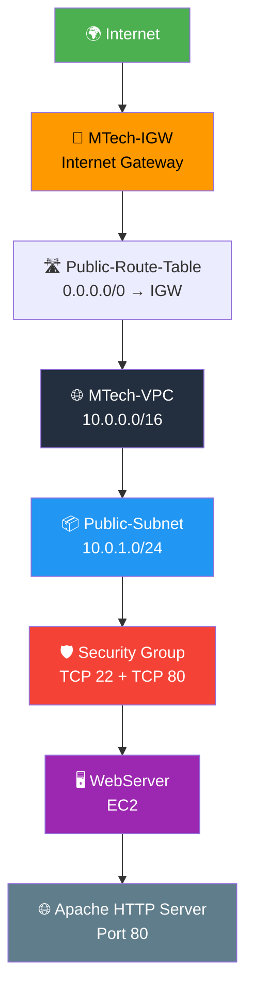
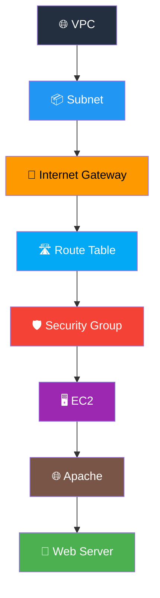

<div align="center">

# ☁️ AWS VPC + EC2 Web Server — Practical 2

### 🌐 Build a VPC and Launch a Web Server

<p>
  
  
  
  
  
</p>

<p>
  <b>Create a secure AWS network and deploy an Apache web server on EC2.</b>
</p>

<br>


</div>

---

# 🎯 Aim

> To create an **Amazon VPC**, configure a **public subnet, Internet Gateway and route table**, and deploy an **Apache web server on an EC2 instance**.

---

# 📋 Requirements

| Requirement | Description |
|---|---|
| ☁️ AWS Account | Active AWS account |
| 🌐 Internet | Stable internet connection |
| 💻 Browser | Chrome / Edge / Firefox |
| 🖥️ EC2 | Amazon EC2 instance |
| 🔐 Key Pair | SSH authentication |
| 🌍 VPC | Custom AWS network |

---

# 🧠 What Will Be Built?

This practical creates the following AWS infrastructure:

```text
☁️ AWS Cloud
      │
      ▼
🌐 MTech-VPC
10.0.0.0/16
      │
      ▼
┌─────────────────────────────┐
│       Public Subnet         │
│       10.0.1.0/24           │
│                             │
│  🖥️ EC2 Web Server          │
│  Apache HTTP Server          │
└──────────────┬──────────────┘
               │
               ▼
        🚪 Internet Gateway
               │
               ▼
           🌍 Internet
```
---

# 🏗️ AWS Architecture



---

# 🔄 Practical Workflow

```text
┌──────────────────────────┐
│ 🌐 AWS Management        │
│    Console               │
└────────────┬─────────────┘
             ↓
┌──────────────────────────┐
│ 🌐 Create VPC            │
│ MTech-VPC                │
│ 10.0.0.0/16              │
└────────────┬─────────────┘
             ↓
┌──────────────────────────┐
│ 📦 Create Public Subnet  │
│ 10.0.1.0/24              │
└────────────┬─────────────┘
             ↓
┌──────────────────────────┐
│ 🚪 Create Internet       │
│    Gateway               │
└────────────┬─────────────┘
             ↓
┌──────────────────────────┐
│ 🛣️ Create Route Table    │
│ 0.0.0.0/0 → IGW          │
└────────────┬─────────────┘
             ↓
┌──────────────────────────┐
│ 🖥️ Launch EC2            │
│ WebServer                │
└────────────┬─────────────┘
             ↓
┌──────────────────────────┐
│ 🛡️ Configure Security    │
│ Group                    │
│ SSH 22 + HTTP 80         │
└────────────┬─────────────┘
             ↓
┌──────────────────────────┐
│ 🔐 SSH into EC2          │
└────────────┬─────────────┘
             ↓
┌──────────────────────────┐
│ 🌐 Install Apache        │
└────────────┬─────────────┘
             ↓
┌──────────────────────────┐
│ 🎉 Open Public IP        │
│ http://PUBLIC-IP         │
└──────────────────────────┘
```

---

# 🚀 Procedure

# Step 1 — Open VPC

Open the **AWS Management Console**.

Search for:

```text
VPC
```

Select:

```text
VPC Dashboard
```

Click:

```text
Create VPC
```

---

# Step 2 — Create VPC

Configure the VPC as follows:

| Setting   | Value         |
| --------- | ------------- |
| Name      | `MTech-VPC`   |
| IPv4 CIDR | `10.0.0.0/16` |

### Configuration

```text
Name:
MTech-VPC

IPv4 CIDR:
10.0.0.0/16
```

Click:

```text
Create VPC
```

### ✅ Expected Result

```text
🌐 MTech-VPC
CIDR: 10.0.0.0/16
```

---

# Step 3 — Create Public Subnet

Navigate to:

```text
VPC
  └── Subnets
       └── Create subnet
```

Configure:

```text
Name:
Public-Subnet

VPC:
MTech-VPC

IPv4 CIDR:
10.0.1.0/24
```

Click:

```text
Create subnet
```

### 📊 Network Addressing

```text
VPC
10.0.0.0/16

        │
        └── Public Subnet
            10.0.1.0/24
```

---

# Step 4 — Create Internet Gateway

Navigate to:

```text
VPC
  └── Internet Gateways
       └── Create Internet Gateway
```

Enter:

```text
Name:
MTech-IGW
```

Click:

```text
Create Internet Gateway
```

---

## 🔗 Attach Internet Gateway

Select:

```text
MTech-IGW
```

Choose:

```text
Actions
   ↓
Attach to VPC
```

Select:

```text
MTech-VPC
```

Click:

```text
Attach
```

### ✅ Expected Architecture

```text
🌍 Internet
     │
     ▼
🚪 MTech-IGW
     │
     ▼
🌐 MTech-VPC
```

---

# Step 5 — Create Route Table

Navigate to:

```text
VPC
  └── Route Tables
       └── Create route table
```

Enter:

```text
Name:
Public-Route-Table

VPC:
MTech-VPC
```

Click:

```text
Create route table
```

---

# 🛣️ Add Internet Route

Open:

```text
Public-Route-Table
```

Go to:

```text
Routes
   ↓
Edit routes
   ↓
Add route
```

Configure:

```text
Destination:
0.0.0.0/0

Target:
Internet Gateway

Gateway:
MTech-IGW
```

Save the route.

### 🔄 Route Flow

```text
0.0.0.0/0
     │
     ▼
MTech-IGW
     │
     ▼
🌍 Internet
```

---

# 🔗 Associate Route Table With Subnet

Open:

```text
Subnet associations
```

Click:

```text
Edit subnet associations
```

Select:

```text
Public-Subnet
```

Save the association.

### ✅ Expected Result

```text
Public-Route-Table
        │
        ├── 0.0.0.0/0 → MTech-IGW
        │
        └── Public-Subnet
```

---

# 🖥️ Step 6 — Launch EC2

Navigate to:

```text
EC2
  └── Instances
       └── Launch Instance
```

---

## 6.1 Instance Name

Enter:

```text
WebServer
```

---

## 6.2 Select AMI

Select an:

```text
Amazon Linux AMI
```

---

## 6.3 Select Instance Type

Example:

```text
t3.micro
```

> Use an instance type eligible for your account's applicable free-tier or current pricing conditions.

---

# 🔐 Step 6.4 — Create / Select Key Pair

Select an existing key pair or create a new one.

Example:

```text
mykey
```

Download and securely store:

```text
mykey.pem
```

⚠️ **Never share your `.pem` private key.**

---

# 🌐 Step 6.5 — Configure Network

Configure:

```text
VPC:
MTech-VPC

Subnet:
Public-Subnet

Auto-assign Public IP:
Enable
```

The final network configuration should look like:

```text
🌐 MTech-VPC
      │
      ▼
📦 Public-Subnet
      │
      ▼
🖥️ WebServer
      │
      ▼
🌍 Public IP
```

---

# 🛡️ Step 7 — Configure Security Group

Create/select a security group.

Example:

```text
Security Group:
WebServer-SG
```

Allow the following inbound traffic:

| Type | Protocol | Port | Source      |
| ---- | -------- | ---: | ----------- |
| SSH  | TCP      |   22 | Your IP     |
| HTTP | TCP      |   80 | `0.0.0.0/0` |

### Recommended Configuration

```text
SSH
TCP
22
YOUR-IP/32
```

```text
HTTP
TCP
80
0.0.0.0/0
```

### 🔐 Security Concept

```text
Internet
   │
   ├── ❌ Random SSH access
   │
   └── ✅ HTTP : 80
             │
             ▼
         Web Server
```

For testing, SSH should ideally be restricted to your own public IP rather than allowing `0.0.0.0/0`.

---

# 🚀 Step 8 — Launch Instance

Review all settings.

Click:

```text
Launch Instance
```

Wait until the instance reaches:

```text
🟢 Running
```

---

# 🔍 Step 9 — Get Public IP

Open:

```text
EC2
  → Instances
  → WebServer
```

Find:

```text
Public IPv4 address
```

Example:

```text
PUBLIC-IP
```

> Your actual public IP will be different.

---

# 🔐 Step 10 — Connect to EC2

For Linux/macOS/Git Bash, use:

```bash
ssh -i mykey.pem ec2-user@PUBLIC-IP
```

Example:

```bash
ssh -i mykey.pem ec2-user@54.123.45.67
```

If required, set the private key permissions:

```bash
chmod 400 mykey.pem
```

---

# 🌐 Step 11 — Install Apache

After connecting to EC2, update the packages:

```bash
sudo dnf update -y
```

Install Apache:

```bash
sudo dnf install httpd -y
```

---

# ▶️ Step 12 — Start Apache

Start the Apache service:

```bash
sudo systemctl start httpd
```

Check the service:

```bash
sudo systemctl status httpd
```

You should see:

```text
Active: active (running)
```

---

# 🔄 Step 13 — Enable Apache at Boot

Run:

```bash
sudo systemctl enable httpd
```

This ensures Apache starts automatically after a system reboot.

---

# 📝 Step 14 — Create Web Page

Run:

```bash
echo "<h1>Welcome to MTech AWS Web Server</h1>" | sudo tee /var/www/html/index.html
```

Verify the file:

```bash
cat /var/www/html/index.html
```

Expected:

```html
<h1>Welcome to MTech AWS Web Server</h1>
```

---

# 🌍 Step 15 — Test Web Server

Open a browser.

Enter:

```text
http://PUBLIC-IP
```

For example:

```text
http://54.123.45.67
```

You should see:

```text
┌─────────────────────────────────────┐
│                                     │
│   Welcome to MTech AWS Web Server   │
│                                     │
└─────────────────────────────────────┘
```

---

# 🧪 Verification

Verify each component:

| Component           | Expected Status          |
| ------------------- | ------------------------ |
| 🌐 VPC              | Created                  |
| 📦 Public Subnet    | Created                  |
| 🚪 Internet Gateway | Attached                 |
| 🛣️ Route Table     | Associated               |
| 🖥️ EC2             | Running                  |
| 🛡️ Security Group  | Ports 22 & 80 configured |
| 🔐 SSH              | Connected                |
| 🌐 Apache           | Running                  |
| 🌍 Web Page         | Accessible               |

---

# 🔍 Complete Architecture

```mermaid
flowchart LR

    U[👨‍💻 User Browser]

    I[🌍 Internet]

    IGW[🚪 Internet Gateway<br/>MTech-IGW]

    RT[🛣️ Public Route Table<br/>0.0.0.0/0]

    VPC["🌐 MTech-VPC<br/>10.0.0.0/16"]

    SUB["📦 Public-Subnet<br/>10.0.1.0/24"]

    SG["🛡️ WebServer-SG<br/>HTTP : 80<br/>SSH : 22"]

    EC2["🖥️ EC2 WebServer<br/>Amazon Linux"]

    WEB["🌐 Apache<br/>HTTP : 80"]

    U --> I
    I --> IGW
    IGW --> RT
    RT --> VPC
    VPC --> SUB
    SUB --> SG
    SG --> EC2
    EC2 --> WEB

    style U fill:#4caf50,color:#fff
    style I fill:#607d8b,color:#fff
    style IGW fill:#ff9900,color:#000
    style RT fill:#2196f3,color:#fff
    style VPC fill:#232f3e,color:#fff
    style SUB fill:#03a9f4,color:#fff
    style SG fill:#f44336,color:#fff
    style EC2 fill:#9c27b0,color:#fff
    style WEB fill:#795548,color:#fff
```



---

# 🧩 Component Relationship

```text
                     🌍 INTERNET
                          │
                          ▼
                  🚪 INTERNET GATEWAY
                    MTech-IGW
                          │
                          ▼
                🛣️ ROUTE TABLE
             Public-Route-Table
                    0.0.0.0/0
                          │
                          ▼
                 🌐 MTech-VPC
                 10.0.0.0/16
                          │
                          ▼
                📦 PUBLIC SUBNET
                 10.0.1.0/24
                          │
                          ▼
                 🛡️ SECURITY GROUP
                   ┌─────────────┐
                   │ SSH   : 22  │
                   │ HTTP  : 80  │
                   └──────┬──────┘
                          │
                          ▼
                   🖥️ EC2 SERVER
                     WebServer
                          │
                          ▼
                   🌐 APACHE HTTPD
                          │
                          ▼
              🎉 MTech Web Page
```

---

# ⚠️ Troubleshooting

## ❌ Problem 1 — Website Not Opening

Check:

```text
EC2 → Security Groups → Inbound Rules
```

Make sure HTTP port `80` is allowed.

---

## ❌ Problem 2 — SSH Connection Failed

Check:

```text
1. EC2 instance is running
2. Public IP is correct
3. Key pair is correct
4. Port 22 is allowed
5. SSH source IP is correct
```

---

## ❌ Problem 3 — Apache Not Running

Run:

```bash
sudo systemctl status httpd
```

If stopped:

```bash
sudo systemctl start httpd
```

---

## ❌ Problem 4 — No Public IP

Check:

```text
EC2
 → Instance
 → Networking
 → Public IPv4 Address
```

The instance must have a public IPv4 address for direct internet access.

---

## ❌ Problem 5 — Route Not Working

Verify:

```text
Public-Route-Table
       │
       ├── 0.0.0.0/0
       │
       └── MTech-IGW
```

Also verify that:

```text
Public-Subnet
       ↓
Public-Route-Table
```

association exists.

---

# 🔐 Security Best Practices

### 1️⃣ Restrict SSH

Avoid:

```text
0.0.0.0/0 → TCP 22
```

Prefer:

```text
YOUR-PUBLIC-IP/32 → TCP 22
```

### 2️⃣ HTTP Can Be Public

For a public website:

```text
0.0.0.0/0 → TCP 80
```

is normally required.

### 3️⃣ Protect Your Key

Never upload:

```text
*.pem
```

to GitHub.

Add to `.gitignore`:

```gitignore
*.pem
```

### 4️⃣ Stop/Delete Resources

AWS resources can incur charges depending on the service, configuration, and account eligibility.

After completing the practical, remove resources that are no longer required.

---

# 📸 Screenshot Checklist

Take screenshots for your practical record:

```text
📸 01 — VPC Dashboard

📸 02 — MTech-VPC Created

📸 03 — Public-Subnet

📸 04 — MTech-IGW

📸 05 — Internet Gateway Attached

📸 06 — Public-Route-Table

📸 07 — 0.0.0.0/0 Route

📸 08 — Subnet Route Association

📸 09 — EC2 Launch Configuration

📸 10 — Running WebServer Instance

📸 11 — Security Group Rules

📸 12 — SSH Connection

📸 13 — Apache Status

📸 14 — index.html

📸 15 — Web Page in Browser
```

---

# 📊 Final Configuration

| Resource            | Configuration        |
| ------------------- | -------------------- |
| 🌐 VPC              | `MTech-VPC`          |
| 📡 VPC CIDR         | `10.0.0.0/16`        |
| 📦 Subnet           | `Public-Subnet`      |
| 📡 Subnet CIDR      | `10.0.1.0/24`        |
| 🚪 Internet Gateway | `MTech-IGW`          |
| 🛣️ Route Table     | `Public-Route-Table` |
| 🌍 Internet Route   | `0.0.0.0/0 → IGW`    |
| 🖥️ EC2             | `WebServer`          |
| 💻 Instance Type    | `t3.micro`           |
| 🌐 Web Server       | Apache HTTPD         |
| 🔐 SSH              | TCP `22`             |
| 🌍 HTTP             | TCP `80`             |

---

# 📚 Concepts Learned

By completing this practical, you learn:

* 🌐 Amazon VPC
* 📦 Subnets
* 🚪 Internet Gateway
* 🛣️ Route Tables
* 🖥️ Amazon EC2
* 🛡️ Security Groups
* 🔐 SSH
* 🌍 Public IP addressing
* 🌐 Apache Web Server
* 🔄 AWS networking flow
* 🔒 Basic cloud security

---

# 🎓 Learning Flow



---

# 📝 Result

> **A VPC with a public subnet and Internet Gateway was successfully created. A route table was configured to provide internet connectivity, and an Apache web server was successfully deployed on an EC2 instance. The web server was accessed through the instance's public IP address.**

---

<div align="center">

# 🎉 Practical 2 Completed Successfully

### ☁️ AWS VPC + EC2 | M.Tech CSE Practical

<p>
  
  
  
  
</p>

<br>


</div>
