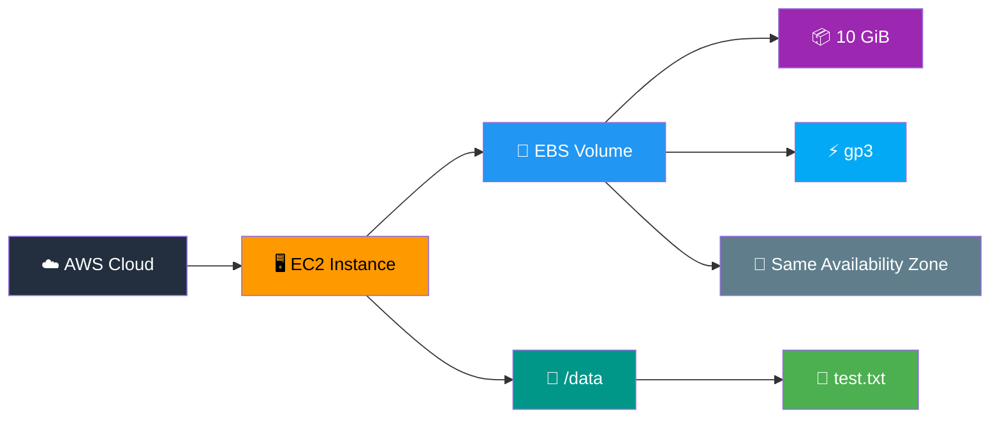

<div align="center">

# 💾 AWS EBS — Practical 4

### ⚡ Study and Implement Working with EBS

<p>
  
  
  
  
  
</p>

<p><b>Create and attach an Amazon Elastic Block Store (EBS) volume to an EC2 instance.</b></p>

<br>


</div>

---

# 🎯 Aim

> To create and attach an **Amazon Elastic Block Store (EBS)** volume to an EC2 instance.

---

# 🚀 Procedure

## Step 1: Open EBS

Go to:

```text
EC2 → Elastic Block Store → Volumes
```

---

## Step 2: Create Volume

Click:

```text
Create volume
```

Example:

```text
Volume Type: gp3
Size: 10 GiB
Availability Zone: Same AZ as EC2
```

Click:

```text
Create volume
```

---

## Step 3: Attach Volume

1. Select the volume.
2. Click **Actions**.
3. Select **Attach volume**.
4. Select your EC2 instance.
5. Attach.

---

## Step 4: Login to EC2

```bash
ssh -i MTech-Key.pem ec2-user@PUBLIC-IP
```

Check disks:

```bash
lsblk
```

You may see a new device such as:

```text
nvme1n1
```

---

## Step 5: Format Volume

> ⚠️ Only do this if the volume is new and contains no data.

```bash
sudo mkfs -t xfs /dev/nvme1n1
```

---

## Step 6: Create Mount Directory

```bash
sudo mkdir /data
```

---

## Step 7: Mount

```bash
sudo mount /dev/nvme1n1 /data
```

Check:

```bash
df -h
```

---

## Step 8: Create File

```bash
sudo touch /data/test.txt
```

```bash
echo "EBS Storage Test" | sudo tee /data/test.txt
```

---

# 🧊  EBS Architecture



---

# 🔄  Storage Flow

```text
                         ☁️ AWS CLOUD
                              │
                              ▼
                  ┌──────────────────────┐
                  │    🖥️ EC2 INSTANCE   │
                  │                      │
                  │    MTech-EC2         │
                  │    🐧 Linux          │
                  └──────────┬───────────┘
                             │
                        ⚡ ATTACH
                             │
                             ▼
                  ╔══════════════════════╗
                  ║      💾 EBS          ║
                  ║                      ║
                  ║      gp3             ║
                  ║      10 GiB          ║
                  ║                      ║
                  ╚══════════╤═══════════╝
                             │
                        🔧 FORMAT
                             │
                             ▼
                       📂 /data
                             │
                             ▼
                       📄 test.txt
                             │
                             ▼
                    💾 EBS STORAGE
```

---

<div align="center">

# 🧊 Visualization

```text
                 ╭──────────────────────────╮
                ╱                          ╱│
               ╱        🖥️ EC2           ╱ │
              ╱        MTech-EC2        ╱  │
             ╰──────────────────────────╯   │
             │                              │
             │                              │
             │          ⚡                  │
             │         ATTACH               │
             │                              │
             ╰──────────────┬───────────────╯
                            │
                            ▼
                  ╭──────────────────╮
                 ╱                  ╱│
                ╱      💾 EBS      ╱ │
               ╱      gp3          ╱  │
              ╰──────────────────╯   │
              │     10 GiB          │
              │                     │
              │       📂 /data      │
              │                     │
              ╰─────────────────────╯
```

---

# 📝 Result

> **An EBS volume was successfully created, attached to EC2, formatted, mounted, and used for data storage.**
<div align="center">

# 🎉 Practical 4 Completed Successfully

---

### 💾 AWS EBS | M.Tech CSE Practical

<p>
  
  
  
  
</p>
<br>


</div>
</div>
